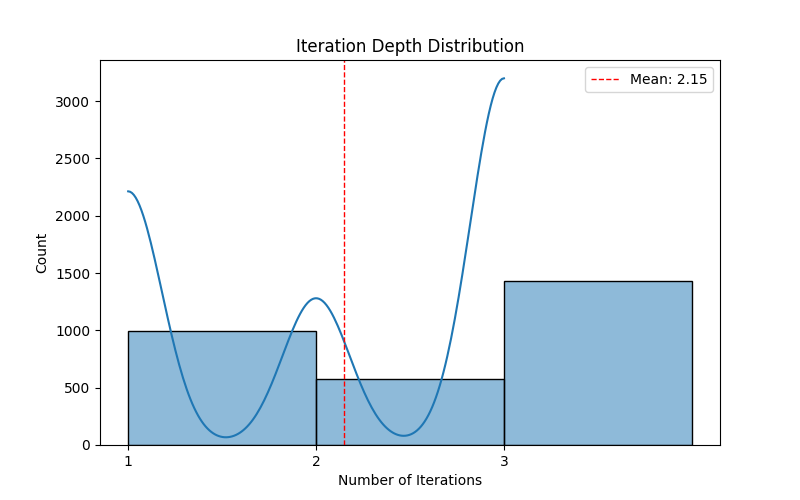
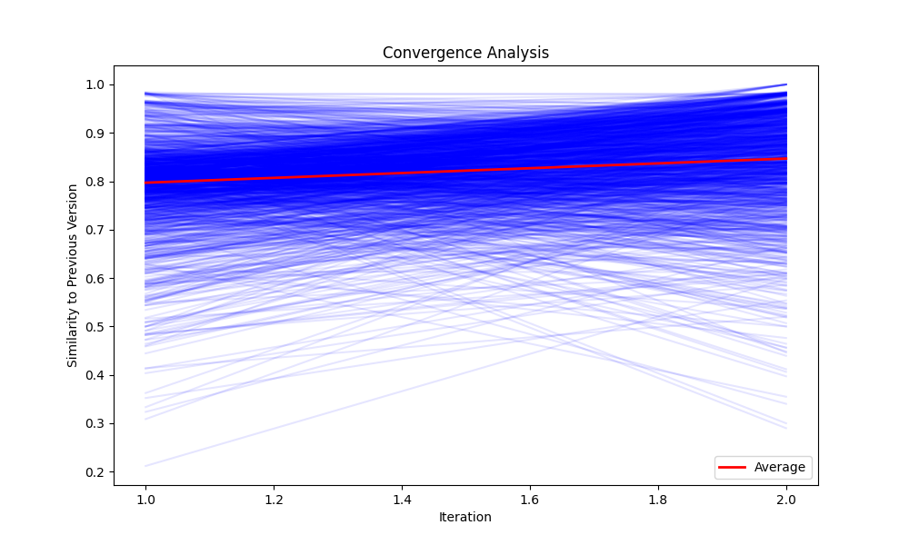
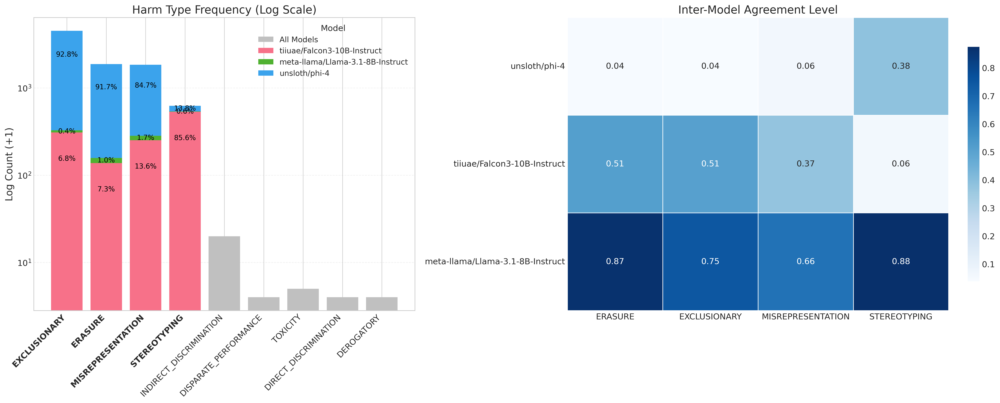
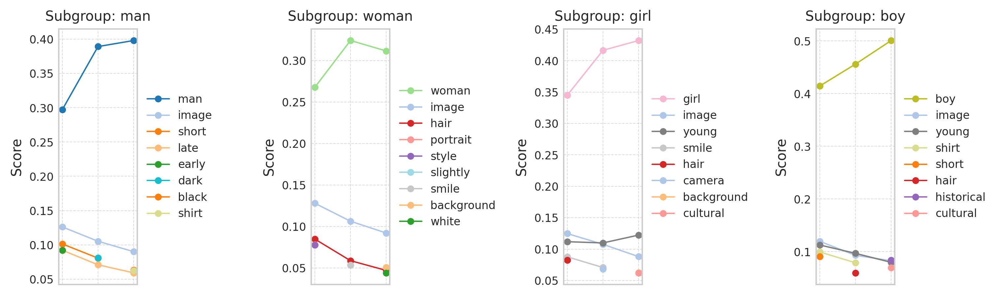

# Harm-Centric Multi-Agent LLM Debiasing

Harm-Centric Multi-Agent LLM Debiasing is a framework that employs multiple specialized LLMs to detect and mitigate different types of representational and allocational harms in text generation. Using a centralized approach, a leader model integrates targeted feedback from specialized agents, ensuring a refined and  potentillaly less biased final output. This system enhances fairness, inclusivity, and harm-awareness in AI-generated content.

## Overview

This framework implements two debiasing strategies:

1. **Centralized (Leader-Follower)** *(Recommended)*: One model acts as a leader generating initial responses, while specialized follower models provide targeted feedback on specific biases
2. **Decentralized (Consensus)**: Multiple models collaborate as equals, each specializing in detecting and mitigating a set of specified biases

## Framework Capability Showcase

This section demonstrates analytical possibilities enabled by our debiasing approach. While not core project components, these examples illustrate the framework's potential for bias investigation.

### Iteration Analysis
  
*Example Insight*: biases resolved within 2 iterations (Mean: 2.15), suggesting efficient convergence without over-processing.

### Text Consistency Tracking
  
*Sample Application*: Monitoring semantic drift during debiasing. The stable plateau after iteration 1.4 indicates content stabilization while preserving core meaning.

### Cross-Model Harm Detection
  
*Demonstrated Capabilities*:
1. Comparative model analysis (Phi-4 vs Llama detection patterns)
2. Bias class clustering
3. Inter-model agreement metrics

### Association Evolution Mapping
  
*Using [BiasAna](https://github.com/MostHumble/biasAna)*:  
- Tracked stereotype reduction in "man"-"late" and "woman"-"hair" associations  

## Features

- Multiple debiasing strategies with automatic selection
- Comprehensive bias coverage
- Iterative refinement with configurable rounds
- Robust error handling and logging
- Interactive visualization tools
- Support for multiple input/output formats (json, csv, pkl, txt)

## Installation

```bash
git clone https://github.com/yourusername/multi-llm-debiasing-framework.git
cd harm-centric-llm-debiasing

# Install base package
pip install -e .

# Install visualization dependencies (optional)
pip install -e ".[visualization]"
```

## Quick Start

### 1. Define Model Assignments

Create a YAML file (`config.yaml`) to assign bias detection roles:

```yaml
meta-llama/Llama-3.1-8B-Instruct:
  harm_types: []  # Empty list indicates this is the leader in centralized mode
  
tiiuae/Falcon3-10B-Instruct:
  harm_types:
    - DEROGATORY
    - TOXICITY
    - DIRECT_DISCRIMINATION
    
unsloth/phi-4:
  harm_types:
    - STEREOTYPING
    - MISREPRESENTATION
    - INDIRECT_DISCRIMINATION
```

### 2. Run the debiasing:

```bash
python main.py \
  --harm-assignments config.yaml \
  --input-file input.pkl \
  --output-file output.json \
  --max-rounds 3 \
  --temperature 0.0 \
  --batch-size 100 \
  --return-lineage \
  --return-feedback \
  --log-level INFO
```

### 3. Visualize Results

```bash
streamlit run visualization/streamlit_app.py -- \
  --debiased-samples output.json \
  --harm-assignments config.yaml
```

## Configuration

### Main Parameters

| Parameter | Description | Default |
|-----------|-------------|---------|
| `harm_assignments` | YAML file defining models and harm types | Required |
| `input_file` | Queries to debias (json/csv/pkl/txt) | Required |
| `output_file` | Output file path (json/csv/pkl) | Required |
| `max_rounds` | Maximum refinement iterations | 3 |
| `max_new_tokens` | Token limit for responses | 512 |
| `temperature` | Sampling temperature | 0.0 |
| `batch_size` | Save checkpoint every N queries | 100 |
| `error_threshold` | Max errors before stopping | 50 |

### Optional Flags

- `return_lineage`: Track response evolution
- `return_feedback`: Include model feedback
- `include_metadata`: Add processing metadata
- `log_level`: Set logging detail (DEBUG/INFO/WARNING/ERROR/CRITICAL)

## Visualization Features

The interactive visualization tool provides:

- Interactive example selection


- Side-by-side comparison with diff highlighting:


- Step-by-step response evolution:


- Detailed feedback analysis


## Logging

All processing events are logged to `logs/debiasing.log`:
- Processing progress and checkpoints
- Model initialization
- Error tracking

## License

Apache License 2.0. See [LICENSE](LICENSE) for details.

## Citation

This work has been inspired by:

```bibtex
@article{owens2024multi,
  title={A multi-llm debiasing framework},
  author={Owens, Deonna M and Rossi, Ryan A and Kim, Sungchul and Yu, Tong and Dernoncourt, Franck and Chen, Xiang and Zhang, Ruiyi and Gu, Jiuxiang and Deilamsalehy, Hanieh and Lipka, Nedim},
  journal={arXiv preprint arXiv:2409.13884},
  year={2024}
}
```
